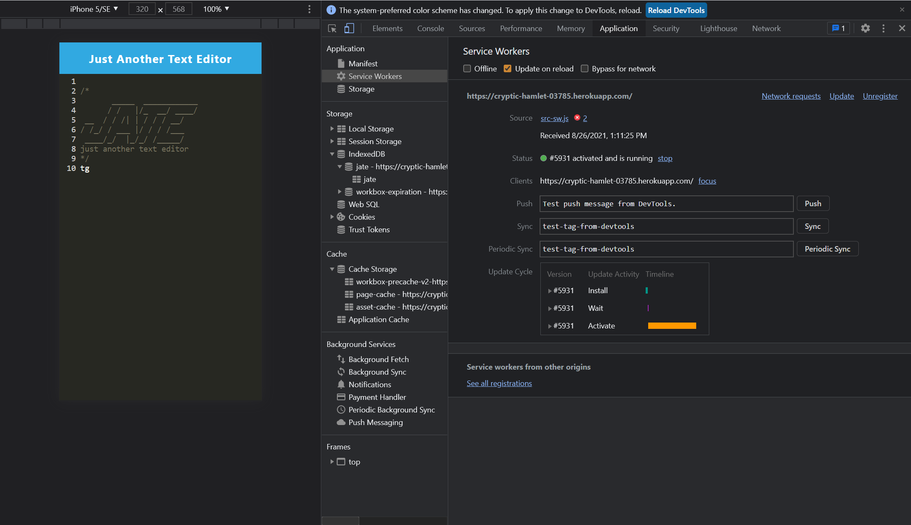

# PWA_text_editor
The app is a single-page application that meets the PWA criteria. It features a number of data persistence techniques that serve as redundancy in case one of the options is not supported by the browser. The application also functions offline.

## Demonstration of application functionality
---

## Deployed URL
---
Application GitHub URL : <a href= "https://github.com/monicadolce/PWA_text_editor">Visit Monica's GitHub Repository</a> 

Application Heroku URL : <a href= "">Visit Monica's Heroku Application</a> 

## References
---
Activities 24, 25, 26 and 28 of PWA.